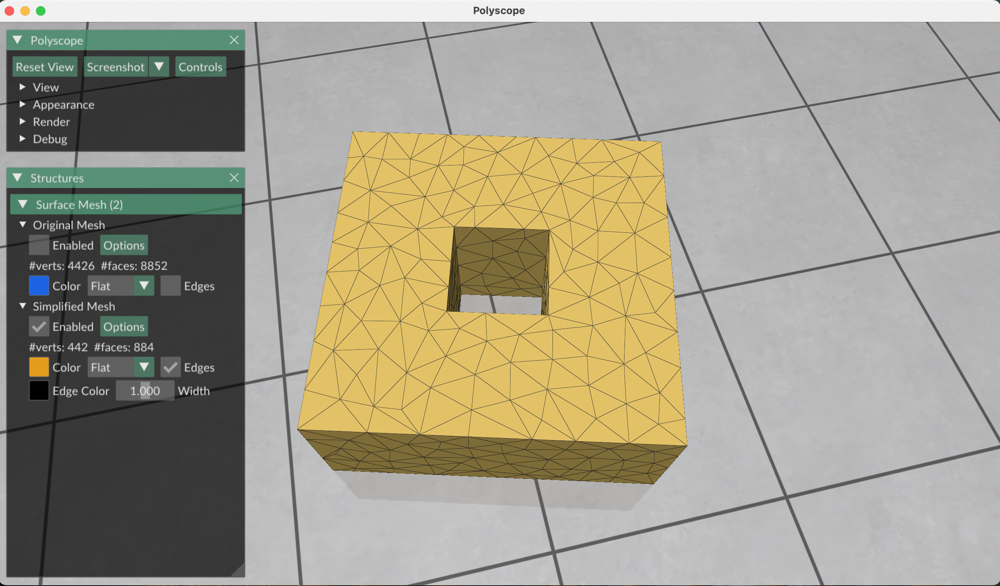

# Line Quadrics

This is a minimal Python implementation to demonstrate how to use _line quadrics_ in mesh simplification, based on the paper ["Controlling Quadric Error Simplification with Line Quadrics"](https://www.dgp.toronto.edu/~hsuehtil/pdf/lineQuadric.pdf) by Hsueh-Ti Derek Liu, Mehdi Rahimzadeh, and Victor Zordan, presented at SGP 2025.

## Installation
First, make sure you have Python 3.8+ installed. Then, install the required dependencies:

```
pip install -r requirements.txt
```

## Running the Demo

To run the mesh simplification example, simply execute:
```
python main.py
```

This will load the input mesh, apply line quadric-based simplification, and output a simplified version with fewer faces while preserving key features better than traditional methods.



